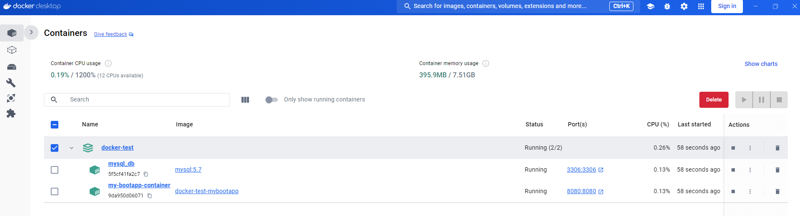
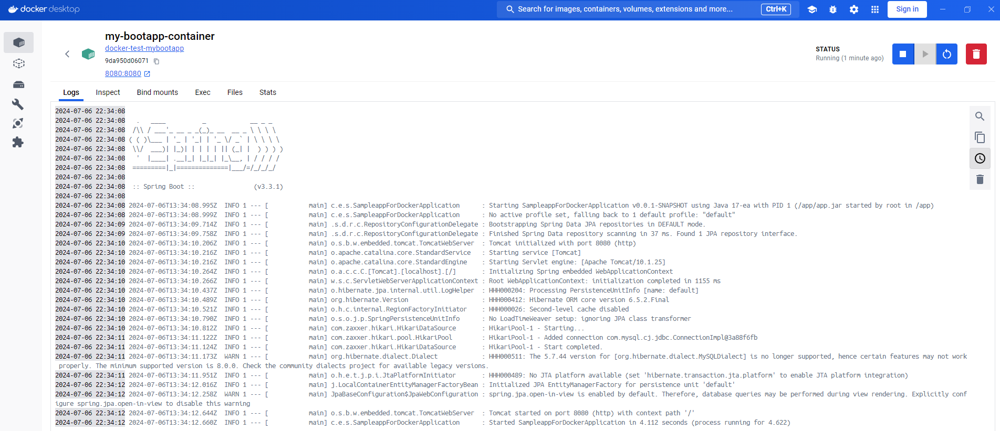
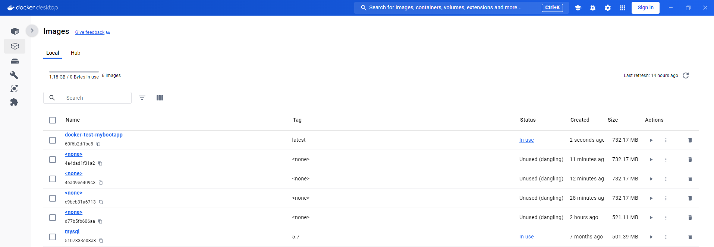
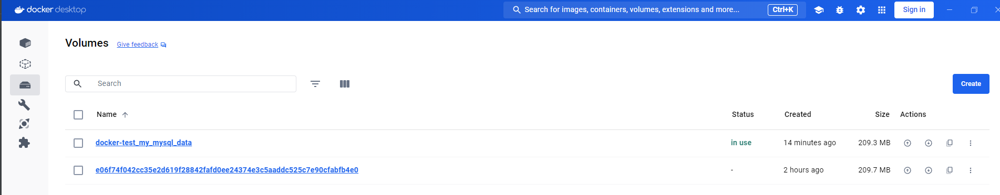
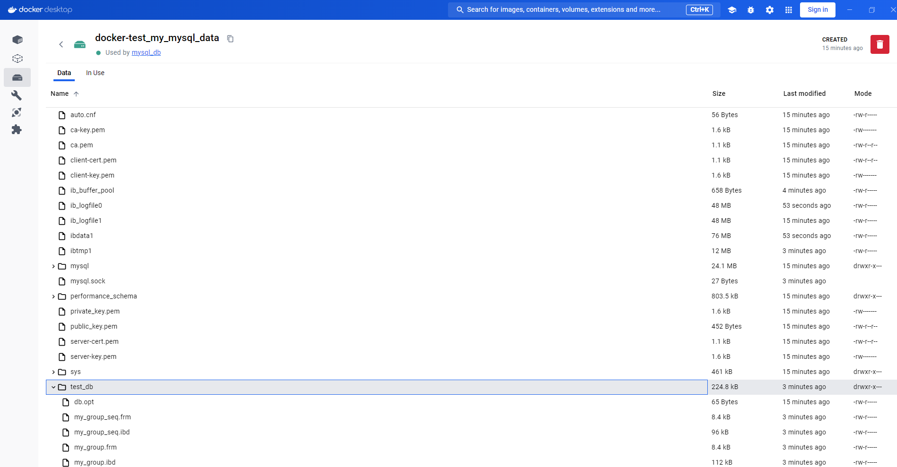
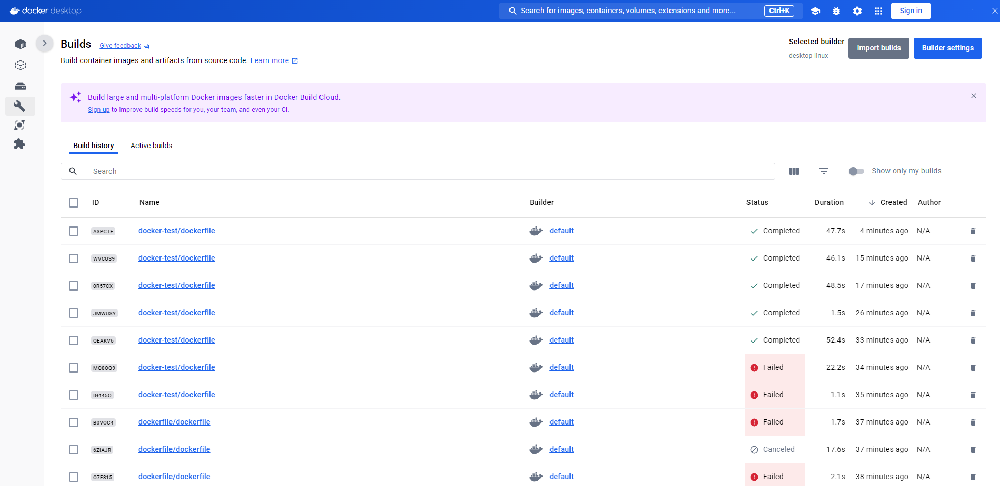
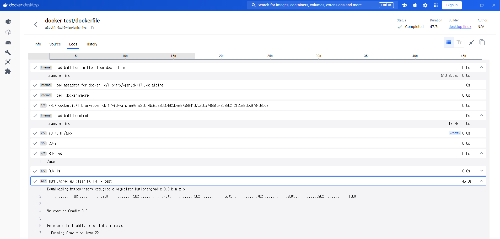

# 실습 환경
- docker는 linux os에서 실행됨
- windows에서는 보통 WSL2을 통해 경량 리눅스 환경을 구성 (윈도우에서 리눅스 VM 올리는 것과 유사한 환경)
- 설치된 docker desktop은, 윈도우 내 WSL2 리눅스 환경을 사용해 dockerd 구동

## docker desktop
container dashboard



image dashboard


volume dashboard



build dashboard

- image build script, log 확인


# 개념
- container: 모든 배포환경 (sources, libs, env\_variables, ...)
- volume: host <-> container 또는 container <-> container 간의 영속성 관련
- network: container간 내부 통신
- hub: public image 저장소 / registry: private image 저장소

# 실습
사전: (windows에서) docker desktop 실행 필요
```
docker run hello-world
흐름: docker client -> dockerd: find&pull hello-world image (from docker hub)
  -> container created. (by dockerd) 
  -> output streamed to docker client (from dockerd)
한줄로: dockerc -> dockerd -> hub -> (conteinr created.) -> dockerc
```


git bash는 docker에서 tty로 인식하지 않아, winpty 명령어 통해 컨테이너 실행
```
winpty docker run -it ubuntu bash
```

image 생성,조회
```
docker build -t my-app-tag .  # -t: tag , .: Dockerfile path
build artifact(image)는 docker hub에 저장됨 (host에 저장 X, docker desktop 사용할 경우 여기에 저장)
```

```
PS C:\Users\hgb\sty> docker images
REPOSITORY      TAG       IMAGE ID       CREATED         SIZE
my-python-app   latest    edbdb77944d3   9 minutes ago   135MB    # docker build -t my-python-app . 결과물
ubuntu          latest    35a88802559d   4 weeks ago     78.1MB
hello-world     latest    d2c94e258dcb   14 months ago   13.3kB
```

container 실행
```
PS C:\Users\hgb\sty> docker run -p 7777:77 my-python-app
 * Serving Flask app 'app'
 * Debug mode: off
WARNING: This is a development server. Do not use it in a production deployment. Use a production WSGI server instead.
 * Running on all addresses (0.0.0.0)
 * Running on http://127.0.0.1:5000  # container에서 찍힌 로그
 * Running on http://172.17.0.2:5000 # container에서 찍힌 로그
Press CTRL+C to quit


문제상황: curl localhost:7777/ => 서버접근X
원인: port mapping 은 잘 됨. 하지만 구동된 WAS가 5000번 포트에서 뜸 (flask default port)
해결
- 1. container port를 5000으로 하여, -p 7777:5000 구동 
- 2. flask 앱을 77 포트로 띄움
```

## Volume
볼륨
- host에 데이터를 영구 저장하는 storage 메커니즘
- host 파일 시스템의 특정 디렉토리로 이해 (아래 driver 옵션 확인)

볼륨 마운트
- 볼륨을 container 내 디렉토리에 연결하는 과정
- container가 해당 디렉토리 접근 -> host가 정의한 볼륨(directory)에 저장된 데이터 CRUD 가능
- localhost filesystem 기본경로: /var/lib/docker/volumes/{volumeName}/_data/
- - (윈도우에는 /var/lib/.. 경로가 없고 WSL을 통한 경로)
- driver
  - 어떤 유형의 영속 storage를 사용할 것인가 지정 (default = "local") 
  - localhost file system (directory) / aws-ebs / gcp-blockstorage, ...
- ``` 가장 간단한 예시 docker-compose.yml
  services:
    mybootapp:
      {기본설정...}
      volumes:
        # 아래 설정된 myvolume을 container의 /var.. 경로에 마운트시킴
        - myvolume:/var/lib/mysql    
  volumes:
    myvolume:
      driver: local      
  ```

## docker-compose
개요
- 하나의 dockerfile로는 하나의 image만 생성, 실행 가능
- 만약 하나의 **host**에서 여러 container 실행하려면, n개의 dockerfile 필요
- 여러 container들을 일괄로 관리하기 위한 기능 (스크립트)
한계점
- production 환경은 서버 인스턴스(host)가 많고 수평확장이 필요
- 즉 분산하여 관리가 필요 => docker-compose 대신 k8s 오케스트레이션 필요

특징
- 단일 host에서 containers 구축에는 매우 적합

명령어
```
docker-compose up
docker-compose down
docker-compose build
```

주의사항
- 이미 image가 있을 경우, up 명령어만 쓸 경우 diff 반영이 안됨
  - => ```docker-compose up --build``` 
  - yml 새로 읽어들여 이미지 빌드 후 컨테이너 실행

## dockerfile 주요명령어
- RUN
  - image **빌드** 시 스크립트
  - 패키지 설치, 파일 다운, 소스 컴파일하여 image에 반영하는 역할
  - e.g. RUN mvn clean install

- ENTRYPOINT
  - (CMD와 유사)
  - container 시작 시 실행프로그램 및 실행커맨드 지정
  - list의 첫번째 인자는 실행프로그램(java, python, ..)으로, **특수하게 인식**

- CMD
  - container 시작 시 기본 명령어
  - container 시작 시 입력되는 arguments들로 override가 가능
  - 따라서 보통 default parameter 또는, 동적 변수들을 지정하는 데 사용
  - **만약 ENTRYPOINT 없이 CMD로만 명령어 구성할 경우, 첫번째 인자를 특수하게 인식(실행 프로그램으로)** 

```
실제 커맨드 예시
// given, when:
ENTRYPOINT [A,B,C]
CMD [D,E]
CMD [1,2]

// then:
  1. docker run mybuildapp 
    => A B C 1 2      // CMD는 맨 마지막 선언된 것만 사용됨
  2. docker run mybuildapp X
    => A B C X        // CMD override됨. EP는 항상 실행
  3. docker run mybuildapp X Y Z
    => A B C X Y Z
```

``` 
best practices(?)

ENTRYPOINT ["java", "-jar", "mybootapp.jar"]
CMD ["-parameters", "-Dspring.profiles.active=local"]
  ```

## spring boot app, mysql(local volume), docker 배포

```
# in docker-compose.yml directory
$ docker-compose up --build

$ curl localhost:8080/groups   # []  empty list
$ curl localhost:8080/groups \
  -H 'content-type: application/json' \
  --data '{"name": "test-group1"}' 
  # add group
$ curl localhost:8080/groups   # [{id:..., name: "test-group1"}]

$ docker-compose down
$ docker-compose up
$ curl localhost:8080/groups   # [{id:..., name: "test-group1"}]  confirm data persistence
```
